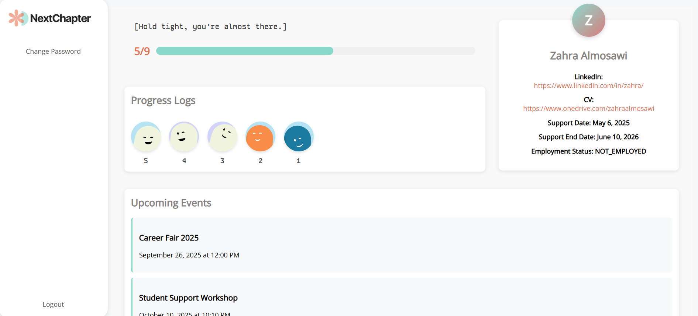

# NextChapter

## Table of Contents
[Overview](#Overview)
[Purpose](#Purpose)
[User Roles](#User-Roles)
[Technologies](#technologies)
[Future Features](#future-features)

## Overview
NextChapter is a Django-based web application designed to support graduate students through a structured 9-month career development program. The system allows trackers (career advisors) to monitor student progress and enables students to view their mentorship journey.

## Purpose
To provide a centralized platform for tracking graduate student career development progress over a 9-month support period, including mentorship interactions, CV updates, interview preparation, and employment outcomes.

## User Roles
1. Trackers (Career Advisors)
- Create and manage student profiles
- Add progress logs for each student interaction
- Monitor student progress through 9-month support period
- Add New Event

2. Students
- View personal dashboard with progress overview
- Monitor progress through the 9-month program
- View upcoming events

## Technologies
- Python 
- Django
- Django Authentication System
- PostgreSQL Database
- HTML
- CSS
 
## Future Features
- Notifications for students about progress updates
- Enhanced Progress Log Validation
- Export outcome reports (PDF)
- Real-time Chat System